# Qwen3：思深，行速

2025年4月29日 · 4 分钟 · 794 字 · Qwen Team | 语言: English

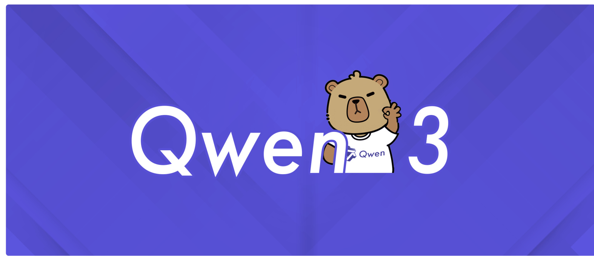

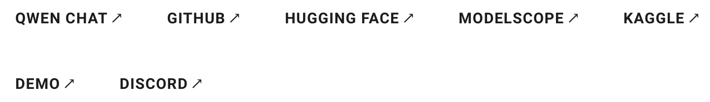

# 引言

今天，我们宣布推出 Qwen3，这是 Qwen 系列大型语言模型的最新成员。我们的旗舰模型 Qwen3-235B-A22B 在代码、数学、通用能力等基准测试中，与 DeepSeek-R1、o1、o3-mini、Grok-3 和 Gemini-2.5-Pro 等顶级模型相比，表现出极具竞争力的结果。此外，小型 MoE 模型 Qwen3-30B-A3B 的激活参数数量是 QwQ-32B 的 10%，表现更胜一筹，甚至像 Qwen3-4B 这样的小模型也能匹敌 Qwen2.5-72B-Instruct 的性能。

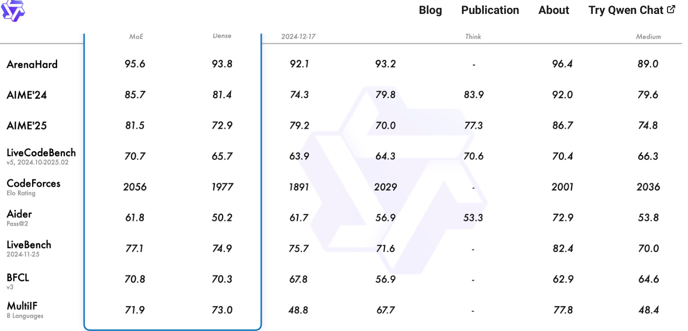

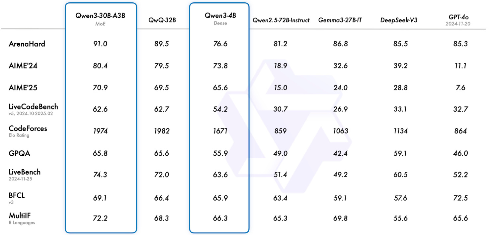

我们开源了两个 MoE 模型的权重：Qwen3-235B-A22B，一个拥有 2350 多亿总参数和 220 多亿激活参数的大模型，以及Qwen3-30B-A3B，一个拥有约 300 亿总参数和 30 亿激活参数的小型 MoE 模型。此外，六个 Dense 模型也已开源，包括 Qwen3-32B、Qwen3-14B、Qwen3-8B、Qwen3-4B、Qwen3-1.7B 和 Qwen3-0.6B，均在Apache 2.0 许可下开源。

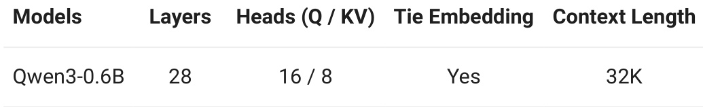

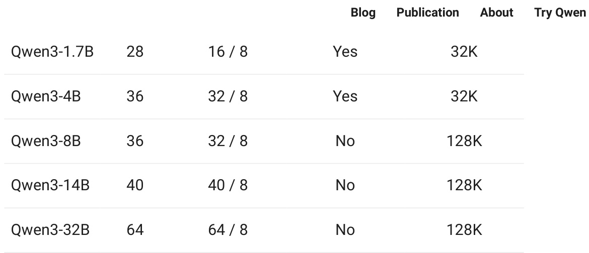

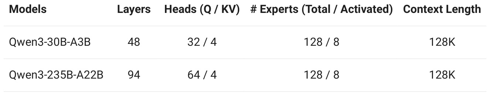

经过后训练的模型，例如 Qwen3-30B-A3B，以及它们的预训练基座模型（如 Qwen3-30B-A3B-Base），现已在Hugging Face、ModelScope 和 Kaggle 等平台上开放使用。对于部署，我们推荐使用 SGLang 和 vLLM 等框架；而对于本地使用，像 Ollama、LMStudio、MLX、llama.cpp 和 KTransformers 这样的工具也非常值得推荐。这些选项确保用户可以轻松将 Qwen3 集成到他们的工作流程中，无论是用于研究、开发还是生产环境。

我们相信，Qwen3 的发布和开源将极大地推动大型基础模型的研究与开发。我们的目标是为全球的研究人员、开发者和组织赋能，帮助他们利用这些前沿模型构建创新解决方案。

欢迎在 Qwen Chat 网页版 (chat.qwen.ai) 和手机 APP 中试用 Qwen3！

# 核心亮点

# 多种思考模式

Qwen3 模型支持两种思考模式：

1. 思考模式：在这种模式下，模型会逐步推理，经过深思熟虑后给出最终答案。这种方法非常适合需要深入思考的复杂问题。2. 非思考模式：在此模式中，模型提供快速、近乎即时的响应，适用于那些对速度要求高于深度的简单问题。

这种灵活性使用户能够根据具体任务控制模型进行“思考”的程度。例如，复杂的问题可以通过扩展推理步骤来解决，而简单的问题则可以直接快速作答，无需延迟。至关重要的是，这两种模式的结合大大增强了模型实现稳定且高效的“思考预算”控制能力。如上文所述，Qwen3 展现出可扩展且平滑的性能提升，这与分配的计算推理预算直接相关。这样的设计让用户能够更轻松地为不同任务配置特定的预算，在成本效益和推理质量之间实现更优的平衡。

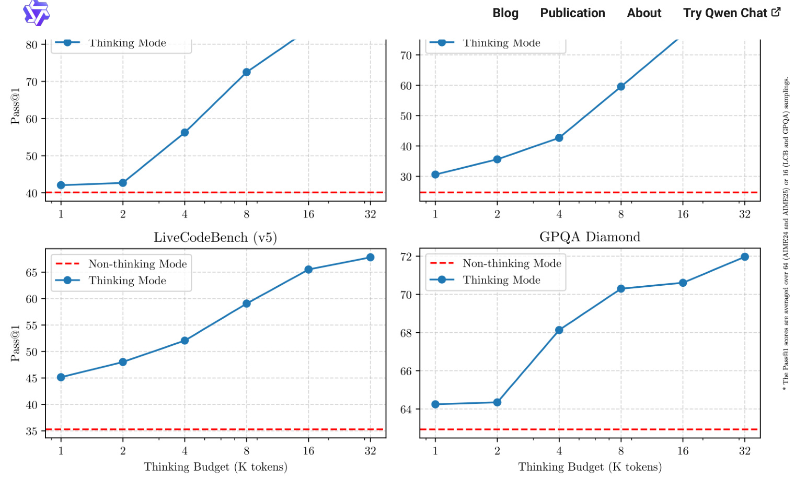

# 多语言

Qwen3 模型支持 119 种语言和方言。这一广泛的多语言能力为国际应用开辟了新的可能性，让全球用户都能受益于这些模型的强大功能。

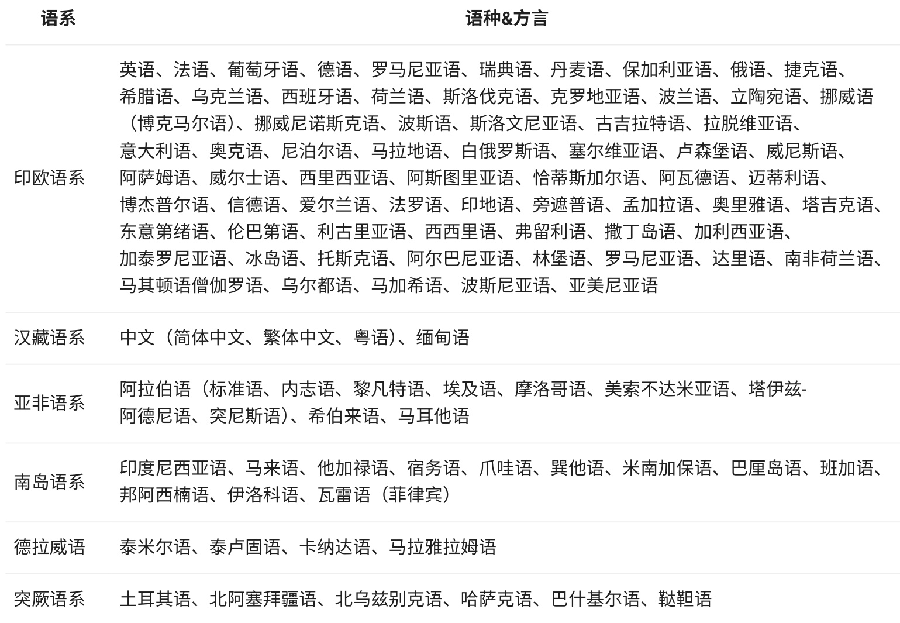

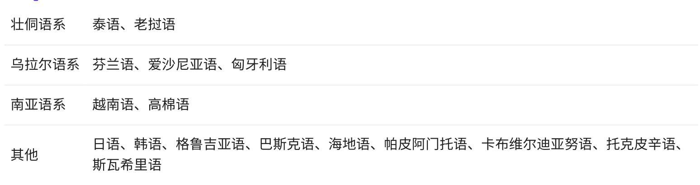

# 增强的 Agent 能力

我们优化了 Qwen3 模型的 Agent 和 代码能力，同时也加强了对 MCP 的支持。下面我们将提供一些示例，展示Qwen3 是如何思考并与环境进行交互的。

# 预训练

在预训练方面，Qwen3 的数据集相比 Qwen2.5 有了显著扩展。Qwen2.5是在 18 万亿个 token 上进行预训练的，而 Qwen3 使用的数据量几乎是其两倍，达到了约 36 万亿个 token，涵盖了 119 种语言和方言。为了构建这个庞大的数据集，我们不仅从网络上收集数据，还从 PDF 文档中提取信息。我们使用 Qwen2.5-VL 从这些文档中提取文本，并用 Qwen2.5 改进提取内容的质量。为了增加数学和代码数据的数量，我们利用 Qwen2.5-Math 和Qwen2.5-Coder 这两个数学和代码领域的专家模型合成数据，合成了包括教科书、问答对以及代码片段等多种形式的数据。

（如 STEM、编程和推理任务）的比例来改进数据集，随后模型又在额外的 5 万亿个 token 上进行了预训练。在最后阶段，我们使用高质量的长上下文数据将上下文长度扩展到 32K token，确保模型能够有效地处理更长的输入。

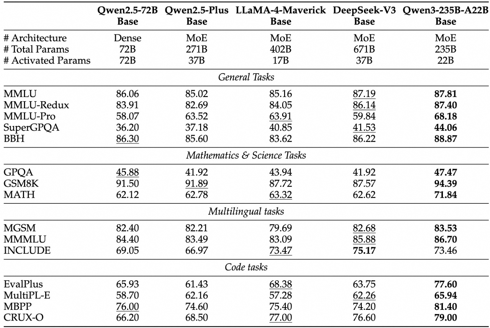

由于模型架构的改进、训练数据的增加以及更有效的训练方法，Qwen3 Dense 基础模型的整体性能与参数更多的Qwen2.5基础模型相当。例如，Qwen3-1.7B/4B/8B/14B/32B-Base 分别与 Qwen2.5-3B/7B/14B/32B/72B-Base 表现相当。特别是在 STEM、编码和推理等领域，Qwen3 Dense 基础模型的表现甚至超过了更大规模的 Qwen2.5 模型。对于 Qwen3 MoE 基础模型，它们在仅使用 10% 激活参数的情况下达到了与 Qwen2.5 Dense 基础模型相似的性能。这带来了训练和推理成本的显著节省。

# 后训练

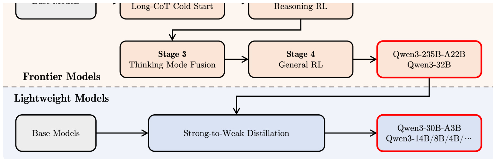

为了开发能够同时具备思考推理和快速响应能力的混合模型，我们实施了一个四阶段的训练流程。该流程包括：（1）长思维链冷启动，（2）长思维链强化学习，（3）思维模式融合，以及（4）通用强化学习。

在第一阶段，我们使用多样的的长思维链数据对模型进行了微调，涵盖了数学、代码、逻辑推理和 STEM 问题等多种任务和领域。这一过程旨在为模型配备基本的推理能力。第二阶段的重点是大规模强化学习，利用基于规则的奖励来增强模型的探索和钻研能力。

在第三阶段，我们在一份包括长思维链数据和常用的指令微调数据的组合数据上对模型进行微调，将非思考模式整合到思考模型中。确保了推理和快速响应能力的无缝结合。最后，在第四阶段，我们在包括指令遵循、格式遵循和 Agent 能力等在内的 20 多个通用领域的任务上应用了强化学习，以进一步增强模型的通用能力并纠正不良行为。

# 开始使用 Qwen3

以下是如何在不同框架中使用 Qwen3 的简单指南。首先，我们提供了一个在 Hugging Face transformers  中使用Qwen3-30B-A3B 的标准示例：

from modelscope import AutoModelForCausalLM, AutoTokenizer   
model_name = "Qwen/Qwen3-30B-A3B"   
# load the tokenizer and the model   
tokenizer = AutoTokenizer.from_pretrained(model_name)   
model = AutoModelForCausalLM.from_pretrained( model_name, torch_dtype="auto", device_map="auto"   
)   
# prepare the model input   
prompt = "Give me a short introduction to large language model."   
messages = [ {"role": "user", "content": prompt}   
]   
text = tokenizer.apply_chat_template( messages, tokenize=False,

model_inputs = tokenizer([text], return_tensors="pt").to(model.device)

# conduct text completion   
generated_ids = model.generate( \*\*model_inputs, max_new_tokens=32768   
)   
output_ids = generated_ids[0][len(model_inputs.input_ids[0]):].tolist()   
# parsing thinking content   
try: # rindex finding 151668 (</think>) index = len(output_ids) - output_ids[::-1].index(151668)   
except ValueError: index = 0   
thinking_content = tokenizer.decode(output_ids[:index], skip_special_tokens=True).strip("\n")   
content = tokenizer.decode(output_ids[index:], skip_special_tokens=True).strip("\n")   
print("thinking content:", thinking_content)   
print("content:", content)

要禁用思考模式，只需对参数 enable_thinking 进行如下修改：

text = tokenizer.apply_chat_template( messages, tokenize=False, add_generation_prompt=True, enable_thinking=False  # True is the default value for enable_thinking.   
)

对于部署，您可以使用 sglang>=0.4.6.post1  或 vllm>=0.8.4  来创建一个与 OpenAI API 兼容的 API endpoint：

SGLang: python -m sglang.launch_server --model-path Qwen/Qwen3-30B-A3B --reasoning-parser qwen3

vLLM:

vllm serve Qwen/Qwen3-30B-A3B --enable-reasoning --reasoning-parser deepseek_r1要禁用思考模式，您可以移除参数 --reasoning-parser （以及 --enable-reasoning ）

如果用于本地开发，您可以通过运行简单的命令 ollama run qwen3:30b-a3b  来使用 ollama 与模型进行交互。您也可以使用 LMStudio 或者 llama.cpp 以及 ktransformers 等代码库进行本地开发。

# 高级用法

我们提供了一种软切换机制，允许用户在 enable_thinking=True  时动态控制模型的行为。具体来说，您可以在用户提示或系统消息中添加 /think  和 /no_think  来逐轮切换模型的思考模式。在多轮对话中，模型会遵循最近的指令。

# 以下是一个多轮对话的示例：

self.history = [] def generate_response(self, user_input): messages = self.history + [{"role": "user" "content": user_input}]

text = self.tokenizer.apply_chat_template( messages, tokenize=False, add_generation_prompt=True   
)   
inputs = self.tokenizer(text, return_tensors="pt")   
response_ids = self.model.generate(\*\*inputs, max_new_tokens=32768)[0][len(inputs.input_ids[0]):].tolist()   
response = self.tokenizer.decode(response_ids, skip_special_tokens=True)

# Update history self.history.append({"role": "user" "content": user_input}) self.history.append({"role": "assistant", "content": response})

return response # Example Usage if __name_ main chatbot = QwenChatbot()

# First input (without /think or /no_think tags, thinking mode is enabled by default)   
user_input_1 = "How many r's in strawberries?"   
print(f"User: {user_input_1}")   
response_1 = chatbot.generate_response(user_input_1)   
print(f"Bot: {response_1}")   
print("-   
# Second input with /no_think   
user_input_2 = "Then, how many r's in blueberries? /no_think"   
print(f"User: {user_input_2}")   
response_2 = chatbot.generate_response(user_input_2)   
print(f"Bot: {response_2}")   
print("   
# Third input with /think   
user_input_3 = "Really? /think"   
print(f"User: {user_input_3}")   
response_3 = chatbot.generate_response(user_input_3)   
print(f"Bot: {response_3}")

# Agent 示例

Qwen3 在工具调用能力方面表现出色。我们推荐使用 Qwen-Agent 来充分发挥 Qwen3 的 Agent 能力。Qwen-Agent 内部封装了工具调用模板和工具调用解析器，大大降低了代码复杂性。

要定义可用的工具，您可以使用 MCP 配置文件，使用 Qwen-Agent 内置的工具，或者自行集成其他工具。

# Define LLM   
llm_cfg = { 'model': 'Qwen3-30B-A3B',

# Use a custom endpoint compatible with OpenAI API: 'model_server': 'http://localhost:8000/v1',  # api_base 'api_key': 'EMPTY'

# Other parameters: # 'generate_cfg': { # # Add: When the response content is \`<think>this is the thought</think>this is the answer; # # Do not add: When the response has been separated by reasoning_content and content. # 'thought_in_content': True, # }, }

# Define Tools   
tools = [ {'mcpServers': {  # You can specify the MCP configuration file 'time': { 'command': 'uvx' 'args': ['mcp-server-time' '--local-timezone=Asia/Shanghai'] "fetch": { "command": "uvx", "args": ["mcp-server-fetch"] } code_interpreter', # Built-in tools   
]

# Define Agent bot = Assistant(llm=llm_cfg, function_list=tools)

# Streaming generation   
messages = [{'role': 'user', 'content': 'https://qwenlm.github.io/blog/ Introduce the latest developments of Qwen'}]   
for responses in bot.run(messages=messages): pass   
print(responses)

# Qwen 的朋友们

感谢众多朋友一直以来对 Qwen 的鼎力支持！我们欢迎更多新朋友加入我们的社区，帮助我们变得更好！

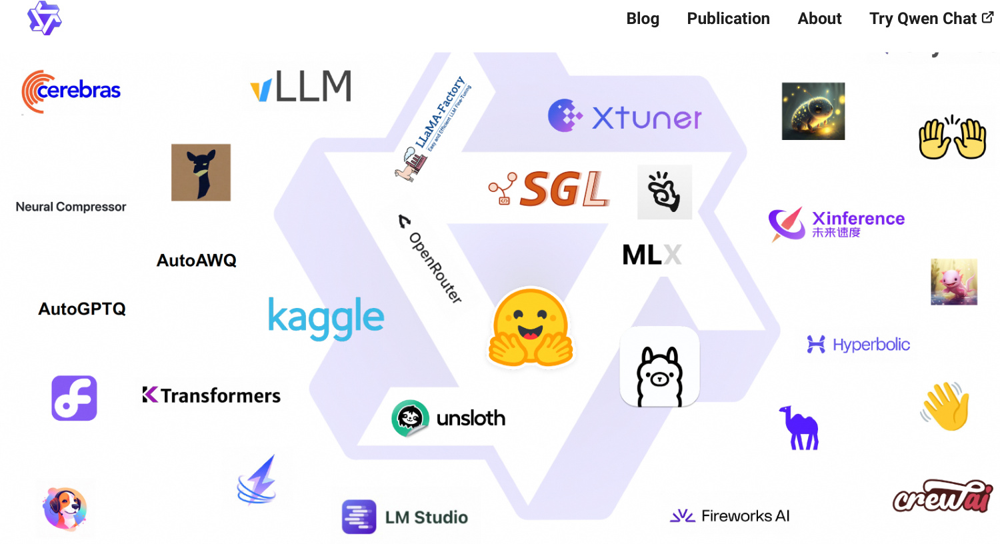

# 未来发展

Qwen3 代表了我们在通往通用人工智能（AGI）和超级人工智能（ASI）旅程中的一个重要里程碑。通过扩大预训练和强化学习的规模，我们实现了更高层次的智能。我们无缝集成了思考模式与非思考模式，为用户提供了灵活控制思考预算的能力。此外，我们还扩展了对多种语言的支持，帮助全球更多用户。

展望未来，我们计划从多个维度提升我们的模型。这包括优化模型架构和训练方法，以实现几个关键目标：扩展数据规模、增加模型大小、延长上下文长度、拓宽模态范围，并利用环境反馈推进强化学习以进行长周期推理。我们认为，我们正从专注于训练模型的时代过渡到以训练 Agent 为中心的时代。我们的下一代迭代将为大家的工作和生活带来有意义的进步。